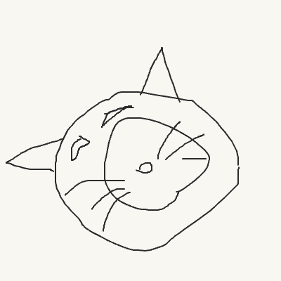
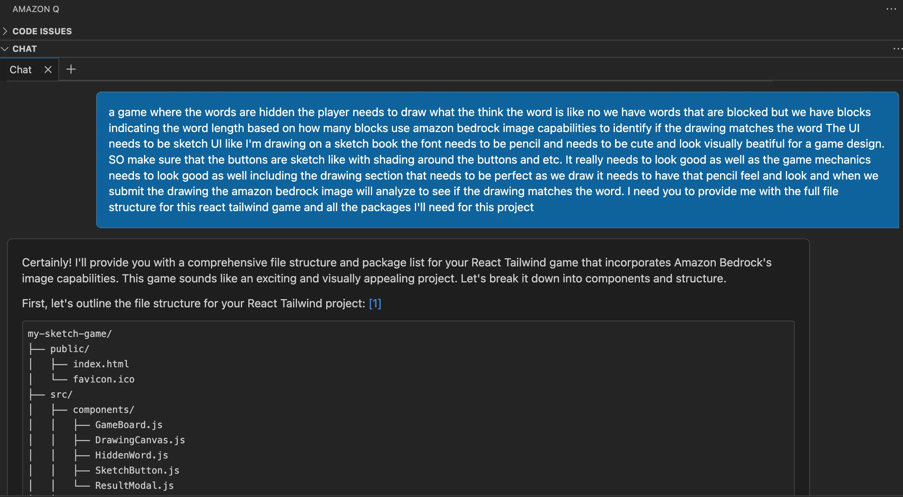
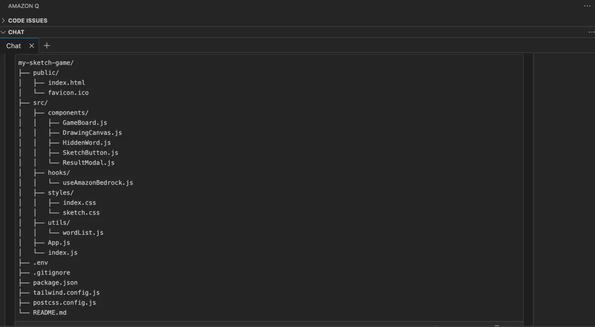
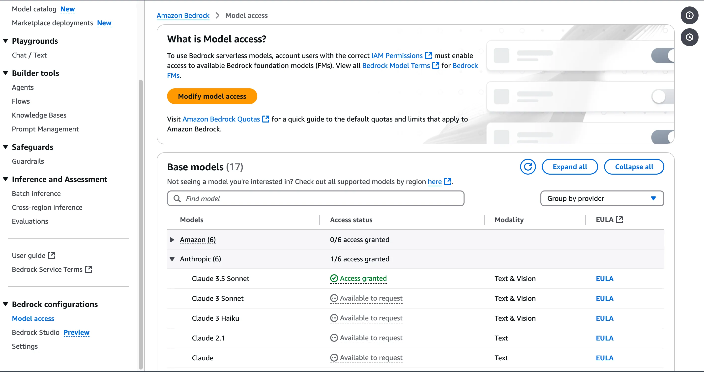
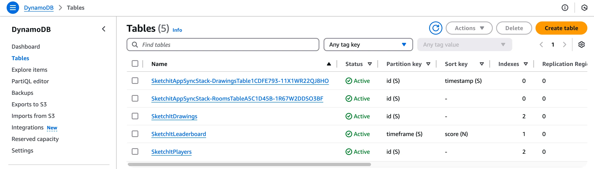
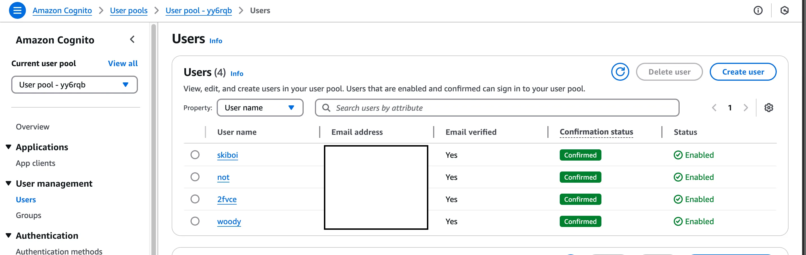
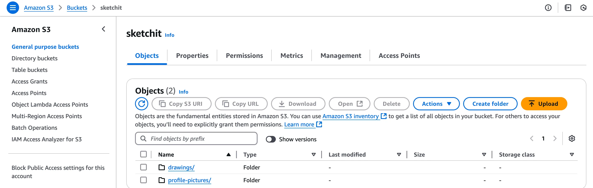
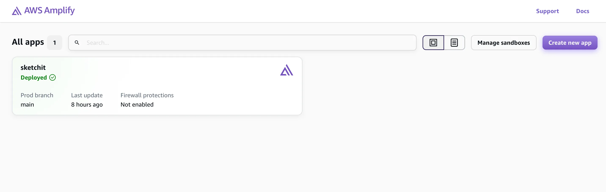

# From Shame to Game: Young Teen Humbles Developer
## The Game That Turns Artistic Shame into Fame

Picture this (pun intended): have you ever had a 13-year-old critique your artistic abilities? Well, I have, and let me tell you-teenagers can be brutally honest! What I thought clearly looked like a cat, my niece's response was 'You can't draw. What's that supposed to be?' crushed whatever ego I had.

The cat in question:



After defending myself for about 30 minutes, the shame I got from my niece inspired me to create Sketch It! - A game where an AI judges your drawings instead of my niece.

The Sketch It game is simple yet hard to master:

* Players are presented with hidden words, shown as blocks indicating word length
* Based on the category and word length, players must draw their interpretation on what the word could be
* Amazon Bedrock's AI image analyzes the drawing to determine if it matches the word
* Players earn points for successful matches, and their scores are tracked on a leaderboard
* All successful drawings are submitted to the gallery for all players to see

### How Amazon Q Helped Me Build it

When I first sat down to build this game, I had only a rough idea but wasn't sure how to structure it. That's when I turned to Amazon Q with what might be the longest, most stream-of-consciousness prompt ever:

"a game where the words are hidden the player needs to draw what the think the word is like no we have words that are blocked but we have blocks indicating the word length based on how many blocks use amazon bedrock image capabilities to identify if the drawing matches the word The UI needs to be sketch UI like I'm drawing on a sketch book the font needs to be pencil and needs to be cute and look visually beautiful for a game design. SO make sure that the buttons are sketch like with shading around the buttons and etc. It really needs to look good as well as the game mechanics needs to look good as well including the drawing section that needs to be perfect as we draw it needs to have that pencil feel and look and when we submit the drawing the amazon bedrock image will analyze to see if the drawing matches the word. I need you to provide me with the full file structure for this react tailwind game and all the packages I'll need for this project"



Yes, that's the exact prompt, in its peak grammar form! Nevertheless, Amazon Q understood the vision I was going for and provided me with a comprehensive file structure, and component breakdown that became the foundation of Sketch It!
```
my-sketch-game/
├── public/
│   ├── index.html
│   ├── favicon.ico
├── src/
│   ├── components/
│   │   ├── GameBoard.js
│   │   ├── DrawingCanvas.js
│   │   ├── HiddenWord.js
│   │   ├── SketchButton.js
│   │   ├── ResultModal.js
│   ├── hooks/
│   │   ├── useAmazonBedrock.js
│   ├── styles/
│   │   ├── index.css
│   │   ├── sketch.css
│   ├── utils/
│   │   ├── wordList.js
│   ├── App.js
│   ├── index.js
├── .env
├── .gitignore
├── package.json
├── tailwind.config.js
├── postcss.config.js
├── README.md
```



Then I asked I asked Amazon Q to create the components and files, which it provided the basic implementation. My main issue with code assistants is that the first run often ends up with bugs, requiring manual intervention. To my surprise not only on the first run did everything run smoothly but the UI and functionality looked and worked flawlessly, and was exactly how I envisioned it. Minus a few layout issues, the design and functionality were a great base to build upon.

First Run 

 
### Implementing Core Features with Amazon Q

Amazon Q helped implement key components, by key components I mean literally everything.
First, I wanted to get the canvas implemented so I asked Amazon Q chat to provide this for me:
```javascript
const DrawingCanvas = ({ onSubmit }) => {
  const canvasRef = useRef(null);
  const contextRef = useRef(null);
  const [isDrawing, setIsDrawing] = useState(false);

  useEffect(() => {
    const canvas = canvasRef.current;
    const context = canvas.getContext('2d');
    
    // Configure canvas for sketch-like drawing
    canvas.width = window.innerWidth * 0.8;
    canvas.height = window.innerWidth * 0.5;
    context.lineCap = 'round';
    context.strokeStyle = '#2B2B2B';
    context.lineWidth = 2;
    
    contextRef.current = context;
  }, []);

  const startDrawing = ({ nativeEvent }) => {
    const { offsetX, offsetY } = nativeEvent;
    contextRef.current.beginPath();
    contextRef.current.moveTo(offsetX, offsetY);
    setIsDrawing(true);
  };

  const draw = ({ nativeEvent }) => {
    if (!isDrawing) return;
    const { offsetX, offsetY } = nativeEvent;
    contextRef.current.lineTo(offsetX, offsetY);
    contextRef.current.stroke();
  };

  const stopDrawing = () => {
    contextRef.current.closePath();
    setIsDrawing(false);
  };

  return (
    <canvas
      ref={canvasRef}
      onMouseDown={startDrawing}
      onMouseMove={draw}
      onMouseUp={stopDrawing}
      onMouseLeave={stopDrawing}
    />
  );
};
```

### Amazon Bedrock for Image Analysis

The core functionality of my game uses Amazon Bedrock for analyzing all the players drawings. Using Claude 3.5 Sonnet, it analyzes players drawings with precision of an art critic, but without the existential crisis-inducing commentary. Here's Amazon Q implementation for it:
```javascript
// services/aws.js
import { BedrockRuntimeClient, InvokeModelCommand } from "@aws-sdk/client-bedrock-runtime";

const analyzeDrawing = async (imageBase64) => {
  const client = new BedrockRuntimeClient({ region: process.env.AWS_REGION });
  
  const payload = {
    task_type: "image_classification",
    image: imageBase64,
    labels: [currentWord],
    confidence_threshold: 0.7
  };

  const command = new InvokeModelCommand({
    modelId: "amazon.titan-image-1p0",
    contentType: "application/json",
    accept: "application/json",
    body: JSON.stringify(payload)
  });

  try {
    const response = await client.send(command);
    return JSON.parse(new TextDecoder().decode(response.body));
  } catch (error) {
    console.error("Error analyzing drawing:", error);
    throw error;
  }
};
```
Amazon Bedrock 

### Amazon DynamoDB for Game State

I used DynamoDB to store game state, leaderboards, drawings, profiles and player scores:
```javascript
// services/database.js
import { DynamoDBClient, PutItemCommand, QueryCommand } from "@aws-sdk/client-dynamodb";

const saveGameResult = async (userId, drawing, word, score) => {
  const client = new DynamoDBClient({ region: process.env.AWS_REGION });
  
  const command = new PutItemCommand({
    TableName: "SketchItGames",
    Item: {
      userId: { S: userId },
      timestamp: { N: Date.now().toString() },
      drawing: { S: drawing },
      word: { S: word },
      score: { N: score.toString() }
    }
  });

  await client.send(command);
};
```
DynamoDB 

### Amazon Cognito for Authentication

User authentication is handled by Amazon Cognito. So only a select few can view my "beautiful drawings:

```javascript
// context/AuthContext.jsx
import { Amplify, Auth } from 'aws-amplify';

Amplify.configure({
  Auth: {
    region: process.env.VITE_AWS_REGION,
    userPoolId: process.env.VITE_COGNITO_USER_POOL_ID,
    userPoolWebClientId: process.env.VITE_COGNITO_CLIENT_ID
  }
});

export const AuthProvider = ({ children }) => {
  const [user, setUser] = useState(null);

  useEffect(() => {
    checkUser();
  }, []);

  async function checkUser() {
    try {
      const user = await Auth.currentAuthenticatedUser();
      setUser(user);
    } catch (error) {
      setUser(null);
    }
  }

  // ... rest of the auth context
};
```
Amazon Cognito 

### Amazon S3 for Drawing Storage

Drawings are stored in S3 for persistence:

```javascript
// services/storage.js
import { S3Client, PutObjectCommand } from "@aws-sdk/client-s3";

const uploadDrawing = async (drawingData, userId) => {
  const client = new S3Client({ region: process.env.AWS_REGION });
  
  const command = new PutObjectCommand({
    Bucket: "sketch-it-drawings",
    Key: `${userId}/${Date.now()}.png`,
    Body: Buffer.from(drawingData.replace(/^data:image\/\w+;base64,/, ""), 'base64'),
    ContentType: 'image/png'
  });

  await client.send(command);
};
```
Amazon S3 

### AWS Amplify

Game is hosted and deployed on Amplify

AWS Amplify 

### Development Challenges and Solutions

1. ### Real-time drawing Performance
Initially, I faced performance issues. Amazon Q helped optimize the code:

```javascript
// Optimized drawing function
const draw = useCallback(({ nativeEvent }) => {
  if (!isDrawing) return;
  const { offsetX, offsetY } = nativeEvent;
  contextRef.current.lineTo(offsetX, offsetY);
  contextRef.current.stroke();
}, [isDrawing]);
```
2. ### AWS Service Rate Limiting
To prevent enthusiastic artists from overwhelming Bedrock's API (and my AWS bill), I implemented a rate limiter. Here's how Amazon Q helped:
```javascript
// utils/rateLimiter.js
class RateLimiter {
  constructor(maxRequests, timeWindow) {
    this.maxRequests = maxRequests;
    this.timeWindow = timeWindow;
    this.requests = [];
  }

  async throttle() {
    const now = Date.now();
    this.requests = this.requests.filter(time => now - time < this.timeWindow);
    
    if (this.requests.length >= this.maxRequests) {
      const oldestRequest = this.requests[0];
      const waitTime = this.timeWindow - (now - oldestRequest);
      await new Promise(resolve => setTimeout(resolve, waitTime));
    }
    
    this.requests.push(now);
  }
}

export const bedrockLimiter = new RateLimiter(1, 1500); // 1 request per 1.5 seconds
```
### Architecture and Data Flow

The application follows a serverless architecture:
1. User authenticates through Cognito
2. Drawing data is captured on the canvas
3. Image is analyzed by Amazon Bedrock
4. Results are stored in DynamoDB
5. Drawing is archived in S3
6. Scores are updated and displayed on the leaderboard

### Lessons Learned

Amazon Q significantly accelerated the development process by:
- Providing accurate initial project structure
- Generating working code implementations from the chat interface or from the /dev command
- Helping debug and optimize performance issues
- Generating well documented README.md based on the codebase, as well as providing sources for further understanding.

AWS Services Integration:
- Bedrock's Image analysis thanks to Claude 3.5 Sonnet
- DynamoDB's single digit millisecond performance is crucial for game responsiveness
- Cognito simplifies user authentication and security
- Sometimes the best ideas come from moments of shame.

### What's Next? (Besides Art Lessons)

On the roadmap, I have few features planned:
- Multiplayer mode (to showcase those art skills and be the best)
- A cozy draw and chat mode, with real time chat features using AppSync
- And maybe, just maybe, a special "niece mode" where the AI is extra honest (for those who can handle the truth)

### Conclusion

Now let's reflect: What started off as a moment of shame has evolved into something pretty amazing. Thanks to Amazon Q and a suite of AWS services, we have created a game where everyone can practice and improve their drawings without fear and judgement.

If you find the cat in question does in fact look like a cat, leave a meow in the comments below.
